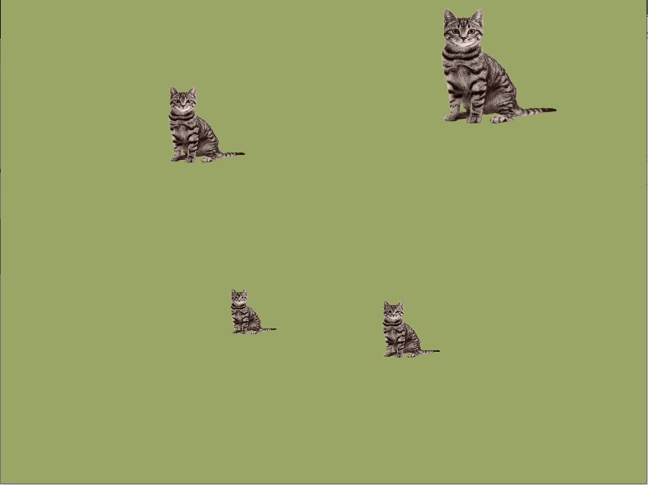

# VulkanCourseProject
This project represents my work during the **["Learn the fundamentals of the popular Vulkan API for modern graphics rendering using C++!"](https://www.udemy.com/course/learn-the-vulkan-api-with-cpp/)** on udemy.

## Build
The only available platform is Windows. VS22 or higher is required (to support c++ 20). 
You also have to install **VulkanSDK** from [here](https://vulkan.lunarg.com/) and update sdk location in project settings in VS.

## Screenshots
 - First quad
 

 - Multiple quads
 

 - Textures
 

 - Updating model transform via push constants (**colored cats!**)
 

 - Model rendering
 
 
 - Extra subpass which uses depth buffer 
 